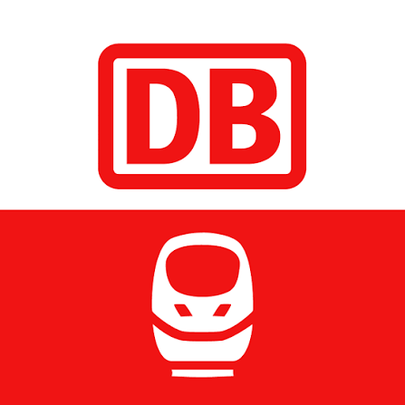
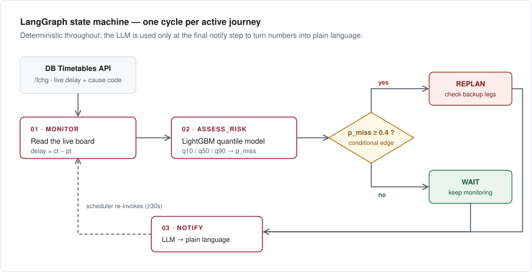

<p align="center">
  
  &nbsp;&nbsp;&nbsp;&nbsp;&nbsp;&nbsp;
  
</p>

<h1 align="center">Journey Resilience Agent</h1>

<p align="center">
  Live transfer-risk monitoring for German rail journeys.<br/>
  <b>LangGraph</b> orchestration · <b>LightGBM</b> quantile regression · official <b>DB Timetables API</b>
</p>

<p align="center">
  
  
  
  
  
</p>

<p align="center">
  <a href="https://journey-resilience-agent-k5iqmk8k2-buaksakals-projects.vercel.app/">
    
  </a>
</p>

<p align="center">
  <b><a href="https://journey-resilience-agent-k5iqmk8k2-buaksakals-projects.vercel.app/">→ View the live interface</a></b><br/>
  <sub>The interface is deployed; the prediction backend runs locally, so the demo shows
  <i>backend offline</i> until you run <code>uvicorn src.api.server:app</code> yourself.</sub>
</p>

---

Most apps tell you a connection failed. This one tells you it's **about to** — while there's still
a train you can catch. A quantile model trained on 5.6M real delay records watches your transfer,
not just your timetable.

---

## How the LangGraph agent works

<p align="center">
  
</p>

The graph is a **state machine**, not a chatbot. Each node does one deterministic job, and a
conditional edge decides whether the journey needs replanning:

| Node | What it does | Implementation |
|---|---|---|
| `monitor` | Reads the station's live board — current delay (`ct − pt`), platform change, delay-cause code | [`src/db_client.py`](src/db_client.py) |
| `assess_risk` | Predicts arrival delay as a calibrated range, converts it to a missed-transfer probability | [`src/ml/risk.py`](src/ml/risk.py) |
| `decide` | Conditional edge — above the threshold the graph branches to replanning | [`src/agent/graph.py`](src/agent/graph.py) |
| `replan` | Checks predefined backup legs, re-running risk assessment on the alternative itself | [`src/agent/graph.py`](src/agent/graph.py) |
| `wait` | No-op; the scheduler re-invokes the graph after the API's 30s refresh window | [`src/agent/graph.py`](src/agent/graph.py) |
| `notify` | Turns the numbers into plain language — **the only step where an LLM is used** | [`src/agent/graph.py`](src/agent/graph.py) |

Why [LangGraph](https://github.com/langchain-ai/langgraph) rather than a polling script: a journey
runs for hours, so the state has to persist across resumptions rather than live in one process.
One `thread_id` per journey, resumed on a schedule — the framework earns its place through state
management and conditional branching, not through prompting.

```python
# src/agent/graph.py
g = StateGraph(JourneyState)
g.add_node("monitor", monitor_node)
g.add_node("assess_risk", assess_risk_node)
g.set_entry_point("monitor")
g.add_edge("monitor", "assess_risk")
g.add_conditional_edges("assess_risk", decide, {"replan": "replan", "wait": "wait"})
g.add_edge("replan", "notify")
g.add_edge("wait", "notify")
```

---

## Quick start

```bash
git clone https://github.com/<user>/journey-resilience-agent.git
cd journey-resilience-agent

python3 -m venv venv && source venv/bin/activate     # Windows: venv\Scripts\activate
pip install -r requirements.txt

cp .env.example .env        # then fill in your DB API credentials
```

Get free credentials at **[developers.deutschebahn.com](https://developers.deutschebahn.com)**:
create an application, subscribe it to the
**[Timetables](https://developers.deutschebahn.com/db-api-marketplace/apis/product/timetables)**
product (free tier, instant approval), then copy the Client ID and Client Secret into `.env`.

```bash
python -m scripts.check_apis              # 1. verify API access
python -m src.data.build_training_pairs   # 2. build ~5.6M training pairs
python -m src.ml.train_delay_model        # 3. train the quantile models
python -m src.agent.graph                 # 4. run the agent once, live

uvicorn src.api.server:app --reload --port 8000   # 5. serve the API
```

Then open [`web/index.html`](web/index.html) in a browser — the header shows a live/offline
indicator for the backend.

---

## Example run

```
[monitor] EVA 8000105 canli veri cekiliyor...
[monitor] ICE 596 | gecikme=33 dk | neden_kodu=47
[assess_risk] tahmini varis gecikmesi -> q10=23.8 q50=32.3 q90=40.9
[assess_risk] tampon 9.0 dk -> p_miss=90.00%
[decide] p_miss=90.00% vs esik=40% -> REPLAN
[notify] Aktarmayi kacirma riski yuksek (%90).
```

Cause code `47` decodes to *Verspätete Bereitstellung* — the train wasn't made available on time.

---

## Data sources — everything used, with links

### Live data

**[DB Timetables API](https://developers.deutschebahn.com/db-api-marketplace/apis/product/timetables)** — official, free tier, instant approval.
Base URL `https://apis.deutschebahn.com/db-api-marketplace/apis/timetables/v1`, auth via
`DB-Client-Id` / `DB-Api-Key` headers, XML responses.

| Endpoint | Purpose |
|---|---|
| `GET /station/{pattern}` | Resolve a station name to its EVA number |
| `GET /plan/{evaNo}/{date}/{hour}` | Scheduled timetable for one station-hour |
| `GET /fchg/{evaNo}` | All current changes — delays, platform changes, cancellations, messages |
| `GET /rchg/{evaNo}` | Only changes from the last 2 minutes (cheaper polling) |

### Historical training data

**[piebro/deutsche-bahn-data](https://huggingface.co/datasets/piebro/deutsche-bahn-data)** on
[Hugging Face](https://huggingface.co/) — CC BY 4.0, ~171M rows collected from the same Timetables API,
published as monthly Parquet files. Code repo: [github.com/piebro/deutsche-bahn-data](https://github.com/piebro/deutsche-bahn-data).
Downloaded via [`huggingface_hub`](https://github.com/huggingface/huggingface_hub):

```python
from huggingface_hub import hf_hub_download
hf_hub_download(repo_id="piebro/deutsche-bahn-data", repo_type="dataset",
                filename="monthly_processed_data/data-2024-07.parquet")
```

The Timetables API only covers roughly ±18 hours, so it cannot serve historical data — this archive
fills that gap.

### Delay-cause code table

DB returns delay causes as bare numeric codes with no text, and publishes no lookup table.
Decoded via the community-maintained
**[Travel::Status::DE::IRIS](https://github.com/derf/Travel-Status-DE-IRIS)** mapping, which is
cross-checked against DB's own IRIS webclient configuration. Treat it as unofficial-but-verified.

| Code | Meaning | Category |
|---|---|---|
| 34, 40, 41 | Signalstörung, Stellwerksstörung | `signal_fault` |
| 11, 22 | Unwetter, witterungsbedingte Störung | `weather` |
| 24, 43, 44, 45, 48 | Verspätung eines vorausfahrenden Zuges, etc. | `cascading_delay` |
| 17, 31, 35 | Bauarbeiten, Streckensperrung | `infrastructure_works` |
| 33, 36, 38, 42 | Technische Störung am Zug / an der Strecke | `technical_fault` |
| 7, 8, 10, 15, 16, 18–20, 23, 28 | Person/object on track, emergency response | `external_incident` |

### Prior art (not integrated — cited for honesty)

- **[Bahnvorhersage](https://bahnvorhersage.de)** ([GitLab](https://gitlab.com/bahnvorhersage)) —
  demonstrated ML-based transfer-success prediction on ~700GB of DB data. Open source,
  Prototype Fund–funded, presented at 38C3.
- **[Trainator](https://trainator.eu)** — commercial probabilistic delay distributions for B2B
  booking platforms.

This project does **not** claim to have invented delay prediction. The contribution is the live
orchestration layer that acts on a probability *during* an active journey.

---

## Model performance

Trained on 1.87M cleaned before/after delay pairs (July 2024), split by journey so no single trip
appears in both train and test sets.

| Quantile | Target coverage | Actual coverage |
|---|---|---|
| q50 | 50% | 56.2% |
| q90 | 90% | **90.7%** |
| q10 | 10% | 29.0% |

**q90 — the quantile the risk decision depends on — is well calibrated.** q10 is not, and this is
disclosed rather than hidden: delay values cluster heavily at 0–2 minutes, which makes the lower
tail hard to separate. Because the safety-relevant decision is taken against the pessimistic end of
the range, the miscalibrated optimistic bound does not drive the outcome.

A second known limitation: gradient-boosted trees do not extrapolate. A delay far outside the
training range collapses to the nearest learned value instead of extending sensibly — which is
exactly why calibration monitoring belongs in the design rather than as an afterthought.

---

## Scope and honest limitations

- **No automatic route search.** Timetables is single-station: it answers *what is happening at this
  station*, never *how do I get from A to B*. The entire RIS family
  ([Connections](https://developers.deutschebahn.com/db-api-marketplace/apis/product/ris-connections-transporteure),
  Journeys, Boards, Stations, Disruptions) requires vetting as an approved DB sales partner with
  contract-negotiated pricing, and the community wrapper
  [`v6.db.transport.rest`](https://v6.db.transport.rest/) is blocked at TLS level from the
  development network. Journeys are therefore defined by leg, and replanning selects from a
  predefined candidate list. A disclosed scope decision, not a hidden gap.
- **No platform-level transfer times.** `RIS::Stations` is the only source for real
  platform-to-platform walking times and is inaccessible, so risk uses scheduled buffer minus
  predicted delay, with no guessed minimum-walk constant.

---

## Project structure

```
journey-resilience-agent/
├── src/
│   ├── config.py                    # all paths, credentials, thresholds
│   ├── db_client.py                 # DB Timetables API wrapper
│   ├── data/build_training_pairs.py # historical data → training pairs
│   ├── ml/train_delay_model.py      # LightGBM quantile training
│   ├── ml/risk.py                   # inference + missed-transfer probability
│   ├── agent/graph.py               # LangGraph state machine
│   └── api/server.py                # FastAPI service
├── scripts/check_apis.py            # data-source connectivity diagnostics
├── web/index.html                   # landing page + live query interface
├── models/                          # trained models (generated)
├── data/                            # training pairs (generated, gitignored)
└── .env                             # credentials (never committed)
```

---

## Built with

[LangGraph](https://github.com/langchain-ai/langgraph) ·
[LightGBM](https://github.com/microsoft/LightGBM) ·
[scikit-learn](https://scikit-learn.org/) ·
[pandas](https://pandas.pydata.org/) ·
[FastAPI](https://fastapi.tiangolo.com/) ·
[Uvicorn](https://www.uvicorn.org/) ·
[Hugging Face Hub](https://github.com/huggingface/huggingface_hub) ·
[three.js](https://github.com/mrdoob/three.js/) ·
[Tailwind CSS](https://tailwindcss.com/)

## License

MIT. Not affiliated with or endorsed by Deutsche Bahn AG; the DB logo is the trademark of its owner
and appears here only to indicate the data source.
